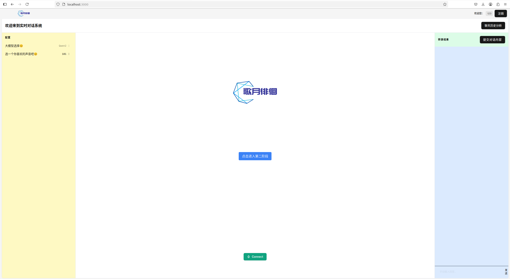

<div align="center"><a name="readme-top"></a>

<h1>LRTChat (Local Real Time Chat)</h1>

完全本地化的实时流对话系统<br/>




</div>

<details>
<summary><kbd>目录树</kbd></summary>

#### TOC

- [项目介绍](#-项目介绍)
- [✨ 组件](#-组件)
  - [`1` WebRTC](#1.WebRTC-实时音视频通信)
  - [`2` STT](#2.STT-语音转文本（Speech-to-Text）)
  - [`3` LLM](#3.LLM-大语言模型推理)
  - [`4` TTS](#4.TTS-文本转语音（Text-to-Speech）)
- [安装](#-安装)
  - [前端](#前端安装)
  - [WebRTC服务](#WebRTC服务)
  - [后端](#后端)
- [使用](#-使用)
  - [文件配置](#文件配置)

####

<br/>

</details>

## 项目介绍


## 组件

### 1.WebRTC-实时音视频通信

本项目采用了 [LiveKit](https://livekit.io/) 作为 WebRTC 的实现框架，用于实现前端与后端之间的低延迟音频传输。  
LiveKit 提供了稳定可靠的媒体服务器和客户端 SDK，支持多用户实时语音通话，并具备良好的可扩展性，便于后续功能拓展。

[LiveKit安装](https://github.com/livekit/livekit)

---

### 2.STT-语音转文本（Speech-to-Text）

语音识别部分集成了 [VoxBox](https://github.com/gpustack/vox-box) 中的 OpenAI 风格 STT 接口，实现了对用户语音输入的实时识别与转写。  
该模块支持中文和英文的高精度识别，适用于实时语音对话场景。
```shell
pip install vox-box
vox-box start --huggingface-repo-id funasr/paraformer-zh-streaming --data-dir ./cache/data-dir --host 0.0.0.0 --port 8111
```
---

### 3.LLM-大语言模型推理

使用 [Ollama](https://ollama.com/) 部署了本地的大语言模型（如 LLaMA 或 Mistral），负责处理语义理解、上下文对话生成等任务。  
通过本地部署的方式，能够有效降低延迟，保障用户隐私，并支持自定义微调。

Ollama请根据官网自行安装。
安装好后，给出api接口地址与模型名称并填入.env：
```shell
LLM_API=http://localhost:11434
LLM_NAME=qwen2
```

---

### 4.TTS-文本转语音（Text-to-Speech）

文本转语音部分使用了开源的 [ChatTTS](https://github.com/2noise/ChatTTS) 项目，支持将大语言模型生成的文本实时转换为自然流畅的语音输出。  
ChatTTS 在多说话人、情感语调方面表现优秀，使对话更加拟人和真实。

[ChatTTS有其流输出的项目](https://github.com/6drf21e/ChatTTS_colab)。

安装完毕后，运行以下代码、
```shell
python api.py
```

## ⚡️ 安装

### 前端安装
```shell
cd ./LRTChat/front/web
pnpm install
pnpm dev
```

### WebRTC服务
[LiveKit启动](https://github.com/livekit/livekit)

```shell
livekit-server --dev
```

获取：

API Key: devkey

API Secret: secret

```shell
cd ./LRTChat/Backend
conda activate -n livekit_env python=3.10
pip install -r requirements.txt
python main.py dev
```

### 后端
```shell
cd ./LRTChat/Backend
python server.py
```

### 填入.env
最终，把所有的本地api接口按照要求填入   ./LRTChat/Backend/.env
